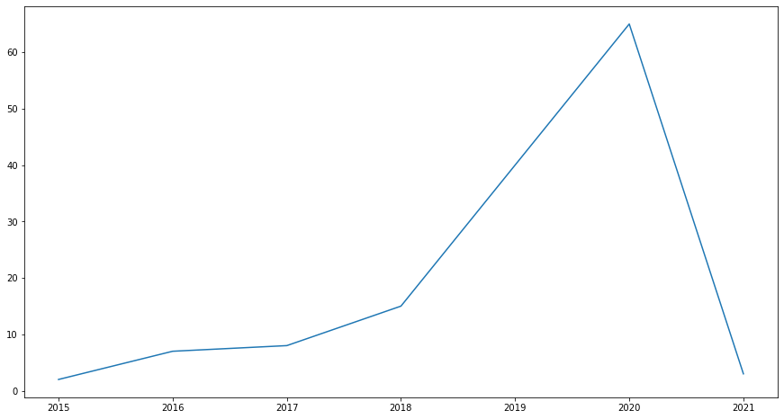
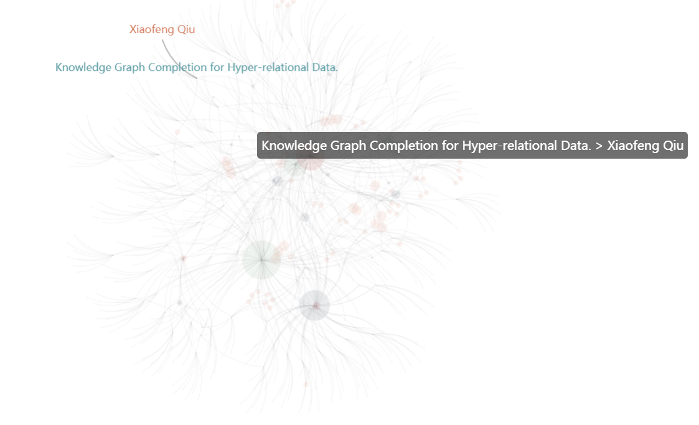
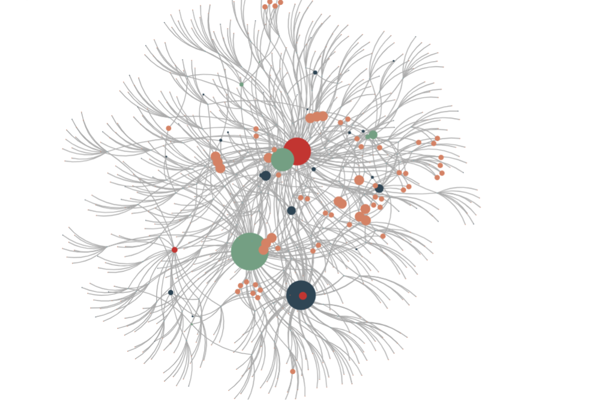

# ResearchInsight
## 刚开始科研工作者来说算一个好工具，想了解对某一个领域的发展情况可以用一用
##系统主要以dblp的公开api来获取文献信息
* ### 根据关键词获取论文列表 ResearchInsight
* ### 根据论文分析按年份发表统计
* ### 从论文列表中查找
* ### 根据论文，作者，年份，发表的期刊。论文类型等实体以之间的关系 构建一个对词领域的知识图谱
## Usecase
```python
from ResearchInsight import ResearchInsight
```


```python
res=ResearchInsight('knowledge graph completion')
```

    ****************************** info ******************************
    paper count:140
    authors count:509
    venue count:52
    published years:{2016, 2017, 2018, 2019, 2020, 2021, 2015}
    


```python
res.trends()
```





```python
res.Search('survey')
```


    (2,
     ['Survey and Open Problems in Privacy Preserving Knowledge Graph - Merging, Query, Representation, Completion and Applications.',
      'A Survey on Graph Neural Networks for Knowledge Graph Completion.'])


```python
res.toGraph()
```


```python

```



## 其中每一个颜色代表一种实体
